# 🚀 Awesome Container Platform Ecosystem

  

  
  
  
  
  

---

## 💡 Overview & Market Insights

Welcome to the **Awesome Container Platform Ecosystem** — a curated list of premier **SaaS platforms** and **Open-Source GitHub projects** for enterprise container orchestration, multi-cluster management, cloud-native runtimes, and developer platforms.

### 📊 Sector Market Size & Dynamics

> [!NOTE]
> 📊 **Market Size:** The global Container Management & Orchestration Platform market is estimated at **$12.5 Billion to $15.0 Billion** (2026), growing at a CAGR of ~24–28%.
> 
> 🧩 **Market Fragmentation:** The sector is **moderately fragmented**, anchored by dominant enterprise giants (Red Hat OpenShift, VMware Tanzu, SUSE Rancher) at the top tier, while specialized platforms (Spectro Cloud, Platform9, Loft Labs) and a vibrant open-source ecosystem (CNCF, Kubernetes subprojects) drive rapid innovation across multi-cloud and edge deployment scenarios.

---

## 📚 Table of Contents

- [☁️ SaaS / Hosted Platforms](#-saas--hosted-platforms)
- [📦 Open-Source GitHub Projects](#-open-source-github-projects)
- [🤝 How to Contribute](#-how-to-contribute)
- [💖 Support & Acknowledgments](#-support--acknowledgments)
- [📈 Star History](#-star-history)
- [⚠️ Disclaimer](#%EF%B8%8F-disclaimer)

---

## ☁️ SaaS / Hosted Platforms

Below is a comparison of leading enterprise SaaS and managed container platforms, sorted by **company scale (valuation / revenue)** in descending order.

| Platform 🏢 | Company Scale (Valuation / Revenue) 💰 | Pricing Model & Starting Price 💵 | Free Tier / Trial Limit 🎁 | Description 📝 |
| :--- | :--- | :--- | :--- | :--- |
| **[VMware Tanzu](https://tanzu.vmware.com/)** | **~$61 Billion** (Broadcom acquisition) | ~$3,000 / core / year (Broadcom VCF bundle) | No general free trial (Custom enterprise demo upon request) | Enterprise Kubernetes portfolio for modernizing & operating multi-cloud workloads at scale. 🏢 |
| **[Canonical Charmed Kubernetes](https://ubuntu.com/kubernetes)** | **~$1.5B – $2.0B** valuation | ~$500 / node / year (Ubuntu Pro support) | 30-day free trial (Ubuntu Pro free tier up to 5 machines for personal use) | Enterprise upstream Kubernetes distribution managed by Canonical Charmed operators. 🐧 |
| **[Red Hat OpenShift](https://www.redhat.com/en/technologies/cloud-computing/openshift)** | **~$1.2 Billion+** ARR (Red Hat / IBM) | ~$1,080 / worker node / year (ROSA / ARO starting on-demand) | 30-Day Developer Sandbox (7GB RAM / 15GB storage shared limit) or 60-Day Self-Managed Trial | Leading hybrid cloud enterprise Kubernetes platform with built-in developer tooling & security. 🔴 |
| **[Spectro Cloud](https://www.spectrocloud.com/)** | **>$1.0 Billion** valuation ($100M Series D) | ~$60 / node / month (Palette enterprise custom billing) | No free trial (1-on-1 enterprise demo & guided POC available) | Multi-cluster Kubernetes management platform (Palette) for hybrid, multi-cloud, and edge. 🎨 |
| **[Rancher (SUSE)](https://www.rancher.com/)** | **~$600M – $700M** valuation (SUSE Rancher unit) | ~$1,000 / node / year (Rancher Prime commercial support) | 100% Free Open Core (Unlimited nodes/clusters for open source Rancher) | Complete multi-cluster Kubernetes management platform for cloud, on-prem, and edge. 🤠 |
| **[Mirantis Kubernetes Engine](https://www.mirantis.com/)** | **~$625 Million** valuation (Acquired by IREN) | ~$900 / node / year (MKE / MCR subscription) | 30-Day Evaluation Cluster (Up to 15 nodes for testing) | Enterprise Kubernetes distribution and container runtime (successor lineage from Docker Enterprise). 🐳 |
| **[Platform9](https://platform9.com/)** | **~$100 Million** total funding (~$38.5M ARR) | $160 / node / month (Platform9 Growth tier) | 100% Free Community Edition (No time limits for small clusters & dev use) | Fully managed SaaS control plane for Kubernetes and private cloud operations across multi-cloud. ☁️ |
| **[Loft Labs (vCluster)](https://www.loft.sh/)** | **~$28.6 Million** total funding | ~$20 / vCluster / month (vCluster Pro commercial tier) | 100% Free open-source vCluster plan (Unlimited self-hosted virtual clusters) | Multi-tenancy and virtual cluster platform for Kubernetes, creating isolated vClusters on demand. 🚀 |
| **[Giant Swarm](https://www.giantswarm.io/)** | **~$15 Million – $25 Million** ARR | ~$2,500 / cluster / month (Custom enterprise managed platform) | No free trial (Guided demo & architecture consultation upon request) | Fully managed Kubernetes and platform engineering stack for high-reliability cloud operations. 🐝 |

---

## 📦 Open-Source GitHub Projects

Curated list of top open-source container platforms, Kubernetes distributions, and control plane tools, sorted by **GitHub Stars_Count** (descending).

| Project 🛠️ | GitHub_Stars ⭐️ | Description 📝 |
| :--- | :--- | :--- |
| **[Kubernetes](https://github.com/kubernetes/kubernetes)** |  | The foundational open-source container orchestration engine and global standard. ☸️ |
| **[k3s](https://github.com/k3s-io/k3s)** |  | Lightweight certified Kubernetes distribution built for IoT, edge, and resource-constrained nodes. 🏎️ |
| **[minikube](https://github.com/kubernetes/minikube)** |  | Local Kubernetes cluster runner tailored for developer workflow and automated testing. 💻 |
| **[Rancher](https://github.com/rancher/rancher)** |  | Powerful multi-cluster Kubernetes management UI, security platform, and provisioning engine. 🤠 |
| **[Argo CD](https://github.com/argoproj/argo-cd)** |  | Declarative GitOps continuous delivery tool for Kubernetes cluster deployments. 🐙 |
| **[KubeSphere](https://github.com/kubesphere/kubesphere)** |  | Distributed operating system for cloud-native application management and multi-cloud clusters. 🌐 |
| **[kind](https://github.com/kubernetes-sigs/kind)** |  | Tool for running local Kubernetes clusters using Docker container nodes (Kubernetes IN Docker). 🐳 |
| **[Talos Linux](https://github.com/siderolabs/talos)** |  | Immutable, minimal, and secure Linux OS designed specifically for hosting Kubernetes clusters. 🔒 |
| **[Flux CD](https://github.com/fluxcd/flux2)** |  | Open and extensible set of continuous delivery solutions for Kubernetes powered by GitOps. ⚡ |
| **[k0s](https://github.com/k0sproject/k0s)** |  | Zero-friction, single-binary Kubernetes distribution designed for any infrastructure. 📦 |
| **[k3d](https://github.com/k3d-io/k3d)** |  | Lightweight wrapper to run Rancher k3s clusters inside Docker containers seamlessly. ⚡ |
| **[vCluster](https://github.com/loft-sh/vcluster)** |  | Virtual Kubernetes clusters running inside regular namespaces for true multi-tenancy. 🔀 |
| **[Cluster API (CAPI)](https://github.com/kubernetes-sigs/cluster-api)** |  | Kubernetes subproject delivering declarative APIs for cluster creation, scaling, & operations. ⚙️ |
| **[Gardener](https://github.com/gardener/gardener)** |  | Homogeneous Kubernetes-clusters-as-a-service manager across heterogenous cloud providers. 🌱 |
| **[RKE2](https://github.com/rancher/rke2)** |  | Security-focused Kubernetes distribution adhering to US Government FIPS and CIS standards. 🛡️ |

---

## 🤝 How to Contribute

We welcome contributions from platform engineers, SREs, and cloud-native enthusiasts! 

1. **Fork** this repository 🍴
2. **Add or update** entries in `README.md` following the exact table structure.
3. Ensure entries include accurate pricing details, free tier limits, or Stars_Counts.
4. **Submit a Pull Request** 🚀 with a brief explanation of the added platform.

---

## 💖 Support & Acknowledgments

If you find this curated list valuable for your infrastructure design or research:

- ⭐ **Star this repository** to show your appreciation!
- 🔀 **Fork & Share** it with fellow SREs, DevOps engineers, and architects.
- ☕ **Buy me a coffee / Sponsor** the project:

Thank you for supporting open-source cloud-native curation! 🙌

---

## 📈 Star History

---

## ⚠️ Disclaimer

- This is a **community-curated list** — not exhaustive and not an official commercial endorsement.
- Container platforms directly manage production compute and network infrastructure. Always conduct internal security, compliance, and performance evaluations before selecting a platform.
